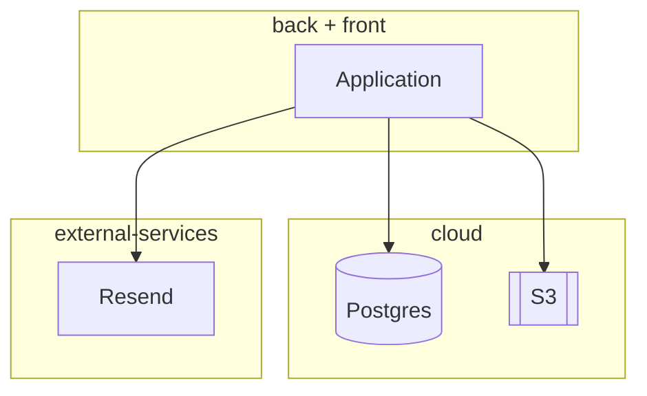
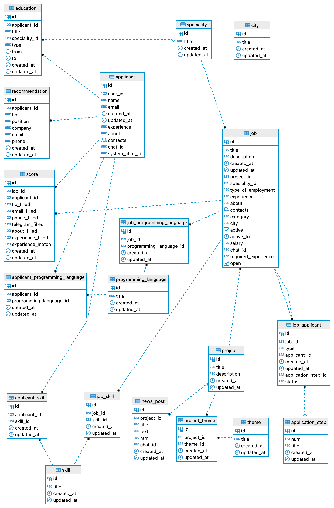
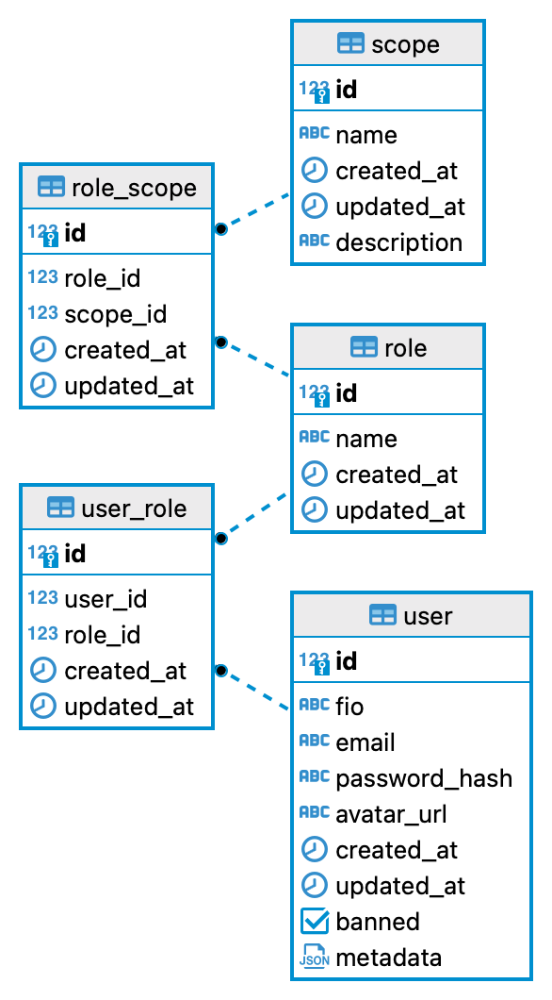
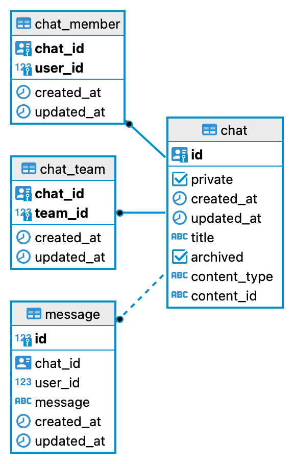
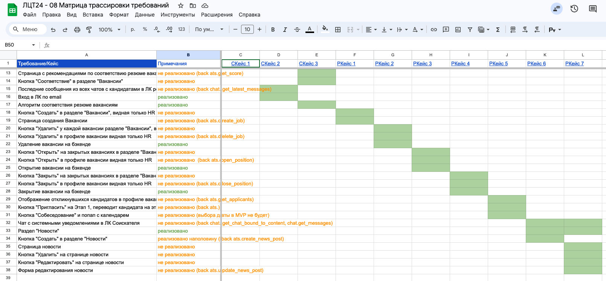

# HR Zero – проект для хакатона Лидеры Цифровой Трансформации 2024

### Что успели сделать за 300 часов!

- 🎉 Бэкенд и фронт сервиса для проведения собеседований
- ✅ 3 микросервиса:
  - для авторизации пользователей по ролям
  - основной бизнес-логикой проведения собеседований
  - чаты для общения с соискателями
- 🌏 Личный кабинет соискателя
- 📕 Скрейпер для сбора вакансий и данных о кандидатах
- 🧨 AI для анализа соответствия резюме вакансиям


## Ссылки

* Сайт: https://hrzero.ru/
* Репозиторий: https://github.com/lct-2024/lct-2024

## Учётные записи для тестирования

**Внимание!** Для удобства проверки демо-стенда, проверка паролей была отключена и для логина можно вводить любой пароль.

- HR: hr@example.com
- Нанимающий менеджер: manager@example.com
- Кандидат 1: sasha@example.com
- Кандидат 2: mary@example.com


## Стек технологий

* Бэкенд на Common Lisp.
* Межсервисное взаимодействие: OpenRPC
* На фронтенде: React + Redux
* База данных - PostgreSQL в облаке.
* Развёртывание всех компонент в Docker.

## Архитектура проекта

Для бэкенда мы реализовали микросервисную архитектуру из 3 сервисов:

- passport - хранит информацию о пользователях и их правах.
- chat - позволяет общаться соискателям и сотрудникам компании.
- ats - хранит все данные и логику работы с соискателями, воронки найма и тд.

Бэкенды общаются между собой и фронтендом с использованием JSON-RPC.

API документировано в формате OpenRPC (аналог OpenAPI и Swagger) и может быть
просмотрено в интерфейсе https://playground.open-rpc.org/. Для этого достаточно ввести
на сайте один из следующих эндпоинтов:

- https://passport.hrzero.ru/
- https://chat.hrzero.ru/
- https://ats.hrzero.ru/

Документация по API автоматически собирается из docstring в коде и складывается в файлы
`openrpc-spec.json` внутри папки каждого из микросервисов. Затем по этим файлам
автоматически генерируется клиент для того, чтобы можно было удобно обращаться из одного
микросервиса в другой.

### Вот так выглядит архитектура сервиса




### Директории

- `/frontend/` - код фронтенда.
- `/backend/` - код бэкенда.


### Applicant Tracking System

Основная бизнес-логика тут. Этот микросервис хранит данные о вакансиях, кандидатах,
этапах собеседований, которые прошёл каждый из кандидатов и прочее.

Вот структура базы данных этого микросервиса (описание схемы `backend/ats/schema.sql`):



Так же, этот микросервис содержит дополнительные алгоритмы для парсинга резюме из файлов загруженных пользователями, и для матчинга резюме и вакансий.

А ещё, здесь же в папке `backend/ats/src/spiders/` есть код скрейперов, с помощью которых производился сбор дополнительных данных о вакансиях и кандидатах.

### Passport (Информация о пользователях, ролях и правах)

Этот микросервис хранить данные о пользователях. Email используется как идентификатор.
В базе хранятся хэши от паролей. Для аутентификации запросов между фронтендом и микросервисами мы используем JWT токены,
в которых зашифрованы основные данные о пользователе и его правах.

С каждым пользователем системы может быть ассоциирована одна или несколько ролей и каждая из ролей может быть ассоциирована с несколькими правами (scopes). Эта система позволяет гибко распределять полномочия между сотрудниками компании.

Мы используем две роли, дающие расширенные полномочия: hr и manager

Вот так выглядит структура базы этого микросервиса:



### Chat

Чаты для общения с кандидатами и между сотрудниками компании. Так же мы используем отдельные чаты для доставки до пользователя таких системных сообщений, как уведомления о переходе на новый этап собеседований, предложений согласовать время собеседования и тд.. В дальнейшем, для уведомлений можно будет подключать новые каналы оповещения, такие как email, telegram, Whatsup.

Структура базы чатов:



Технически, чаты устроены так, что доступ к ним может быть ограничен для определённой группы сотрудников компании.

## Матрица трассировки требований

Для тестирования мы описали 10 сценариев и составили такую матрицу трассировки требований:




## Как собрать PDF с документацией

```
sudo apt-get install pandoc wkhtmltopdf

pandoc README.md \
       -t html \
       --pdf-engine-opt=--enable-local-file-access \
       --title 'ЛЦТ24 "Мы из Будущего"' \
       -o README.pdf
```

## Несколько скринов с демо интерфейса (TODO: обновить)

### Дашборд HR сотрудника


### Игра помогающая лучше узнать коллег


