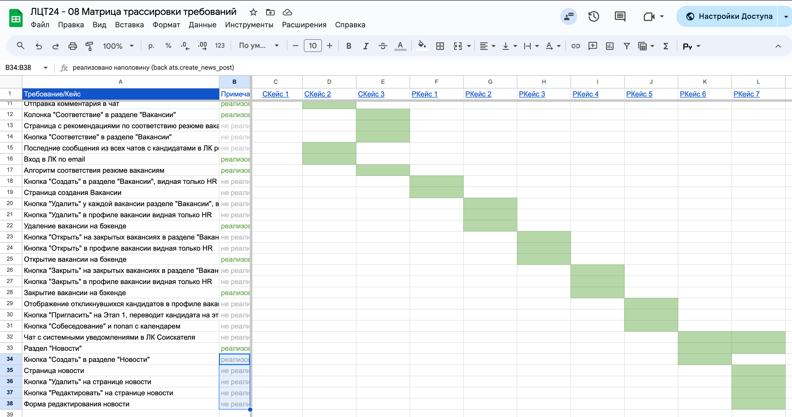

## Директории

- `/frontend/` - код фронтенда.
- `/backend/` - код бэкенда.

## Как собрать проект

TODO: сделать инструкцию

## Структура базы


## Матрица трассировки требований




## Как собрать PDF с документацией

```
sudo apt-get install pandoc wkhtmltopdf

pandoc README.md \
       -t html \
       --pdf-engine-opt=--enable-local-file-access \
       --title 'ЛЦТ24 "Мы из Будущего"' \
       -o README.pdf
```
